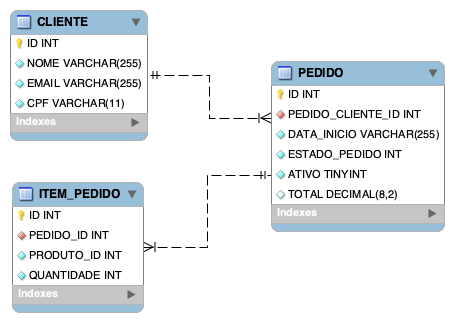

# Banco de Dados (MS Pedido)

## Banco de Dados escolhido

Inicialmente, o time havia escolhido o MySQL como banco de dados para o projeto, mas quando houve a migração para a nuvem suportada pela AWS Services, o MySQL foi substituído pelo Amazon Aurora MySQL.

Essa decisão nos permitiu aproveitar as vantagens de se ter um banco de dados mais adequado ao ambiente de nuvem, sem a necessidade de refatorar o código da aplicação.

Os motivos da escolha pelo MySQL / Aurora estão detalhados abaixo, ressaltando que o termo MySQL será utilizado para se referir a ambos, exceto na subseção que descreve a substituição do MySQL pelo Amazon Aurora MySQL.

### SGDB Relacional

O MySQL é um banco de dados relacional que naturalmente obriga que os dados inseridos sejam consistentes.

Para uma aplicação que realiza cadastro de produtos, controle de pedidos e pagamentos, é vital que os dados estejam sempre consistentes e que a integridade de dados seja sempre mantida.

Além disso, sua estrutura relacional reduz a probabilidade de bugs que causem a inserção parcial de dados. Por exemplo, o banco relacional com os devidos relacionamentos entre as entidades não permitirá o cadastrar um produto sem categoria ou com uma categoria inexistente.

Uma vantagem sobre bancos NoSQL é a capacidade de realizar consultas complexas envolvendo várias tabelas com relativa facilidade e desempenho. Apesar de muitos bancos NoSQL também permitirem esse tipo de consulta, ela tende a ser mais complexa para codificar e ter um custo de processamento relativamente maior a medida que a massa de dados aumenta.

### Custo

O MySQL oferece uma versão gratuita, o que condiz com o propósito educacional do projeto.

### Familiariadade do time com o MySQL

Por sua popularidade e tempo de existência, todos no time tinham bastante experiência com ele.

### Substituição do MySQL pelo Amazon Aurora MySQL

Durante a criação dos scripts de Terraform para a criação da infraestrutura na AWS, foram constatadas limitações para criar o banco de dados, suas tabelas, e a carga inicial de dados durante a configuração de uma instância MySQL no RDS.

Ao substituirmos o MySQL por um cluster Aurora MySQL, foi possível a utilização de um task ECS para a criação do banco de dados dentro da instância RDS, bem como a criação das tabelas necessárias e efetuar a carga inicial de dados.

Adotando-se o Aurora MySQL, foi possível manter a compatibilidade com o MySQL sem a necessidade de refatoração do código da aplicação, e ainda obter as vantagens de se utilizar um banco de dados desenvolvido especificamente para a nuvem:

- Escalabilidade automática
- Alta disponibilidade e múltiplas zonas de disponibilidade
- Backup automático
- Aumento de desempenho em até 5x em relação ao MySQL

A desvantagem é que o cluster Aurora MySQL não possui uma versão gratuita, e seu uso em produção seria ligeiramente mais caro do que o RDS MySQL, mas as vantagens superam esse ônus.

## Modelo de dados

### Diagrama



### Código DBML

```dbml
Table "CLIENTE" {
  "ID" INT [pk, increment]
  "NOME" VARCHAR(255) [not null]
  "EMAIL" VARCHAR(255) [not null]
  "CPF" VARCHAR(11) [not null]

Indexes {
  EMAIL [unique, name: "cliente_email_idx"]
  CPF [unique, name: "cliente_cpf_idx"]
}
}

Table "PEDIDO" {
  "ID" INT [pk, increment]
  "PEDIDO_CLIENTE_ID" INT [not null]
  "DATA_INICIO" VARCHAR(255) [not null]
  "ESTADO_PEDIDO" INT [not null]
  "ATIVO" BOOLEAN [not null, default: TRUE]
  "TOTAL" DECIMAL(8,2)
}

Table "ITEM_PEDIDO" {
  "ID" INT [pk, increment]
  "PEDIDO_ID" INT [not null]
  "PRODUTO_ID" INT [not null]
  "QUANTIDADE" INT [not null]
}


Ref "FK_PEDIDO_CLIENTE_ID":"CLIENTE"."ID" < "PEDIDO"."PEDIDO_CLIENTE_ID"
Ref "FK_PEDIDO_ID":"PEDIDO"."ID" < "ITEM_PEDIDO"."PEDIDO_ID"
```

### Código SQL

```sql
-- Criação de banco de dados
CREATE DATABASE IF NOT EXISTS FAST_N_FOODIOUS;

USE FAST_N_FOODIOUS;

--
-- CRIAÇÃO DE TABELAS
--

-- Tabela cliente
CREATE TABLE IF NOT EXISTS CLIENTE (
                                       ID INT AUTO_INCREMENT PRIMARY KEY,
                                       NOME VARCHAR(255) NOT NULL,
                                       EMAIL VARCHAR(255) NOT NULL,
                                       CPF VARCHAR(11) NOT NULL
);

-- indexes para tabela CLIENTE
CREATE UNIQUE INDEX cliente_email_idx ON CLIENTE(EMAIL);
CREATE UNIQUE INDEX cliente_cpf_idx ON CLIENTE(CPF);

-- Tabela PEDIDO
CREATE TABLE IF NOT EXISTS PEDIDO (
                                       ID INT AUTO_INCREMENT PRIMARY KEY,
                                       PEDIDO_CLIENTE_ID INT NOT NULL, CONSTRAINT FK_PEDIDO_CLIENTE_ID FOREIGN KEY (PEDIDO_CLIENTE_ID) REFERENCES CLIENTE(ID),
                                       DATA_INICIO VARCHAR(255) NOT NULL,
                                       ESTADO_PEDIDO INT NOT NULL,
                                       ATIVO BOOLEAN NOT NULL DEFAULT TRUE,
                                       TOTAL DECIMAL(8,2) NULL
);

-- Tabela ITEMS DE PEDIDO
CREATE TABLE IF NOT EXISTS ITEM_PEDIDO (
                                       ID INT AUTO_INCREMENT PRIMARY KEY,
                                       PEDIDO_ID INT NOT NULL, CONSTRAINT FK_PEDIDO_ID FOREIGN KEY (PEDIDO_ID) REFERENCES PEDIDO(ID),
                                       PRODUTO_ID INT NOT NULL,
                                       QUANTIDADE INT NOT NULL
);
```

## Melhorias

Não foram identificadas melhorias necessárias no modelo de dados para serem realizadas no momento, exceto a substituição do MySQL pelo Aurora MySQL pelas razões acima descritas.

Pontos importantes:

- intencionalmente não houve definição de regras de negócio no banco de dados, como triggers ou stored procedures, para que somente a aplicação seja responsável pela lógica de negócio.
- o campo imagem da tabela PRODUTO foi definido como TEXT para não demandar conversão para gravação ou recuperação de imagens de produto durante a execução da aplicação.
  - se necessário por motivos de desempenho, o campo poderia ser modificado para algum tipo binário, ou então a aplicação poderia ser modificada para salvar as imagens no S3 e o campo passaria a guardar apenas uma URL para os arquivos.

Ademais, o foco do trabalho nesta fase foi a migração da aplicação para a nuvem, e a estratégia [_Rehost_](https://docs.aws.amazon.com/prescriptive-guidance/latest/large-migration-guide/migration-strategies.html#rehost) foi a escolhida por ser a que causaria o menor impacto possível sem comprometer as funcionalidades da aplicação, ao mesmo tempo em que não adicionaria complexidades desnecessárias, uma vez que, pela definição da Amazon, preconiza a transposição da aplicação para a nuvem sem alterações no código (_lift and shift_).
