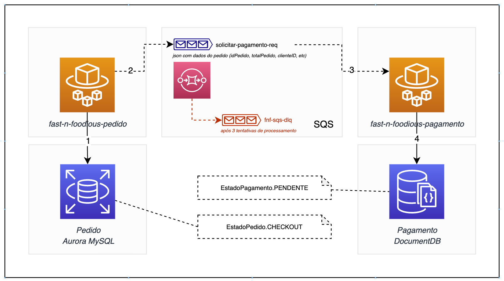
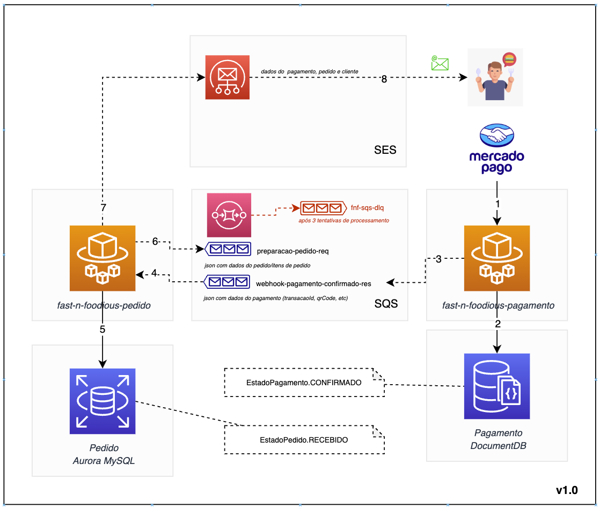
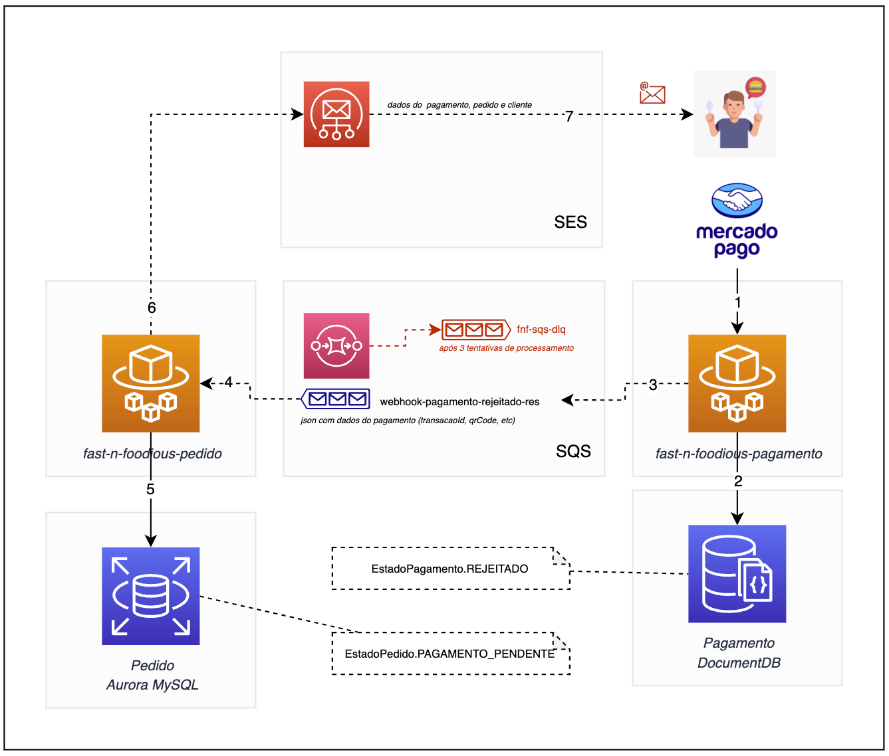

# 🍔 Fast & Foodious - SAGAs

* [Justificativa do Padrão SAGA coreografado](#-justificativa-do-padrão-saga-coreografado)
    * [Base Conceitual](#base-conceitual)
    * [Vantagens do Padrão SAGA coreografado](#vantagens-do-padrão-saga-coreografado)
    * [Tradeoff](#tradeoff)
    * [Aplicabilidade](#aplicabilidade)
    * [Conclusão](#-conclusão)
* [SAGAs](#sagas)
    * [Checkout: Solicitação de Pagamento](#checkout-solicitação-de-pagamento)
    * [Webhook: Atualização de estado de Pagamento Confirmado](#webhook-atualização-de-estado-de-pagamento-confirmado)
    * [Webhook: Atualização de estado de Pagamento Rejeitado](#webhook-atualização-de-estado-de-pagamento-rejeitado)

## Justificativa do Padrão SAGA coreografado
O padrão SAGA coreografado foi escolhido para a comunicação entre os microserviços fast-n-foodious-ms-pedido e fast-n-foodious-ms-pagamento.
Esta decisão foi tomada com base em várias considerações conceituais, vantagens específicas oferecidas pelo padrão e a aplicabilidade do mesmo ao cenário do contexto deste projeto acadêmico.

### Base conceitual
O padrão SAGA é uma abordagem para manter a consistência dos dados em sistemas distribuídos, garantindo atomicidade, consistência, isolamento e durabilidade (ACID) mesmo em ambientes distribuídos.
No caso do padrão SAGA coreografado, as etapas da saga são coordenadas diretamente entre os serviços participantes, sem a necessidade de um controlador centralizado. Cada serviço sabe o que precisa fazer e quando, permitindo uma maior autonomia e desacoplamento entre os serviços.

### Vantagens do Padrão SAGA coreografado
**Desacoplamento**: Cada serviço participante da saga pode evoluir independentemente, pois não há dependência de um controlador centralizado. Isso facilita a manutenção e o escalonamento do sistema.
**Flexibilidade**: O padrão SAGA coreografado oferece flexibilidade na definição e execução das etapas da saga. Cada serviço pode definir suas próprias etapas e coordenar diretamente com outros serviços, permitindo uma adaptação fácil a diferentes cenários de negócios.
**Tolerância a falhas**: O uso de mensagens assíncronas (AWS SQS neste projeto) permite lidar com falhas de forma resiliente. O mecanismo de DLQ (Dead Letter Queue) garante que as mensagens impossibilitadas de serem processadas sejam tratadas adequadamente e possam ser reprocessadas posteriormente.
**Facilidade de implementação na AWS**: A integração com AWS SQS (Simple Queue Service) oferece uma maneira simples e confiável de enviar e receber mensagens entre os microserviços, facilitando a implementação do padrão SAGA na nuvem AWS.

### Tradeoff
**Complexidade adicional**: Embora ofereça flexibilidade, o padrão SAGA coreografado pode introduzir complexidade adicional no sistema, especialmente em termos de coordenação e comunicação entre os serviços participantes da saga. Considerando que nosso contexto é simples, envolvendo apenas 2 microserviços, o tradeoff aqui é aceitável.

### Aplicabilidade
O padrão SAGA coreografado foi considerado apropriado para o cenário apresentado neste projeto por várias razões:

- A comunicação entre os microserviços fast-n-foodious-ms-pedido e fast-n-foodious-ms-pagamento envolve uma série de etapas relacionadas que precisam ser coordenadas de forma flexível e desacoplada.
- O uso de mensagens assíncronas via AWS SQS permite lidar com a comunicação entre os microserviços de forma resiliente e escalável.
- A abordagem coreografada oferece autonomia aos serviços participantes, permitindo que cada serviço defina suas próprias etapas e coordene diretamente com outros serviços.
- A natureza distribuída do sistema, com diferentes serviços e bancos de dados, se beneficia da flexibilidade e tolerância a falhas oferecidas pelo padrão SAGA coreografado na nuvem AWS.

### Conclusão
O padrão SAGA coreografado foi escolhido como a abordagem de comunicação entre os microserviços devido à sua flexibilidade, desacoplamento e tolerância a falhas, que são essenciais para garantir a consistência dos dados em sistemas distribuídos. A implementação na nuvem AWS, usando AWS SQS e SES, facilita a integração e operação do padrão SAGA neste projeto de arquitetura de software.

# Sagas
## Checkout: Solicitação de Pagamento
Integração entre micro serviços de pedido e pagamento, no processo de checkout.

1-Atualização de estado de pedido para `CHECKOUT`no Aurora Mysql
2-Publicação de mensagem com dados do pedido (idPedido, totalPedido, clienteID, etc) na fila `solicitar-pagamento-req`
3-Consumo da fila `solicitar-pagamento-req`
4-Atualização de estado do pagamento para `PENDENTE` no DocumentDB
**Nota:** Caso a solicitação de pagamento não seja processada após 03 tentativas, a mensagem é enviada para DLQ

## Webhook: Atualização estado de Pagamento Confirmado
Integração entre micro serviços de pagamento e pedido, no processo notificação de pagamento confirmado (webhook).

1-Notificação do provider de pagamento, com o status de pagamento confirmado
2-Atualização de estado do pagamento para `CONFIRMADO` no DocumentDB
3-Publicação de mensagem com dados do pagamento (idPagamento, transacaoId, etc) na fila `webhook-pagamento-confirmado-res`
4-Consumo da fila `webhook-pagamento-confirmado-res`
5-Atualização de estado de pedido para `RECEBIDO`no Aurora Mysql
6-Publicação de mensagem com dados do pedido (pedidoId, itens, etc) na fila `preparacao-pedido-req`
7/8-Envio de mensagem ao cliente sobre pagamento confirmado e início da preparação do pedido.
**Nota:** Caso notificação de pagamento confirmado não seja processada após 03 tentativas, a mensagem é enviada para DLQ

## Webhook: Atualização estado de Pagamento Rejeitado
Integração entre micro serviços de pagamento e pedido, no processo notificação de pagamento rejeitado (webhook).

1-Notificação do provider de pagamento, com o status de pagamento rejeitado
2-Atualização de estado do pagamento para `REJEITADO` no DocumentDB
3-Publicação de mensagem com dados do pagamento (idPagamento, transacaoId, etc) na fila `webhook-pagamento-rejeitado-res`
4-Consumo da fila `webhook-pagamento-rejeitado-res`
5-Atualização de estado de pedido para `PAGAMENTO_PENDENTE`no Aurora Mysql
6/7-Envio de mensagem ao cliente sobre pagamento rejeitado.
**Nota:** Caso notificação de pagamento rejeitado não seja processada após 03 tentativas, a mensagem é enviada para DLQ